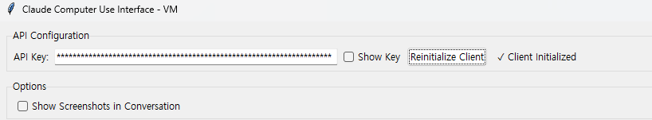
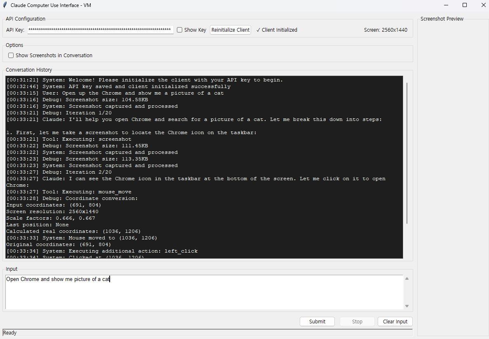

# ClaudeComputerUseBeta-Win64

Beta trial code for the **Claude 3.5 Sonnet Computer Use (Beta) on __Win64__**.

 ⚠️ [!Warning]: Please use this script with caution.

As noted in the [Anthropic Computer Use (Beta) Documentation](https://docs.anthropic.com/en/docs/build-with-claude/computer-use), it is recommended that the Computer Use to be ran on Virtual Machines. 

For Docker based Computer Use (Beta), please visit [Anthropic Computer Use (Beta)](https://github.com/anthropics/anthropic-quickstarts/tree/main/computer-use-demo).

For Macos Demo Computer Use, please visit [PallavAg's Repo](https://github.com/PallavAg/claude-computer-use-macos/tree/main).

**This repo is made to run on Windows but are large part compatible for other major operating systems.** Any participation is welcome, please let me know if there are issues or advices. 


## Installation and Setup

### Recommended: Using a Virtual Machine

1. Set up a virtual machine using software like VMware or VirtualBox.

2. Clone the repository in your virtual machine:
   ```
   git clone https://github.com/MinjaeKIM753/ClaudeComputerUseBeta-Win64.git
   cd ClaudeComputerUseBeta-Win64
   ```

3. Install the required packages:
   ```
   pip install -r requirements.txt
   ```

O. (Optional) Set API key as an environment variable:
   - You can set the API key as an environment variable using one of the following methods:
     - **Windows Command Prompt** 
     Run the command `setx ANTHROPIC_API_KEY your_api_key` (replace `your_api_key` with your actual API key).
     - **Windows PowerShell** 
     Run the command `[Environment]::SetEnvironmentVariable("ANTHROPIC_API_KEY", "your_api_key", "Machine")` (replace `your_api_key` with your actual API key).
     - **Environment Variable Settings** 
     You can also set the API key as an environment variable through your system's environment variable settings.
     - **macOS (using Terminal)**
     Run the command `export ANTHROPIC_API_KEY=your_api_key` (replace `your_api_key` with your actual API key).
     - **Linux (using Terminal)**
     Run the command `export ANTHROPIC_API_KEY=your_api_key` (replace `your_api_key` with your actual API key).
     - **Other Operating Systems**
     Please refer to your operating system's documentation for setting environment variables.

4. Run the application:
   ```
   python main.py
   ```

Note: Make sure you have Python 3.7 or higher installed on your system.

## Usage

### Step 1. Initialize with API Key

Insert your Claude API Key in the main window, and press Initialize.




### Step 2. Submit Your Prompt

Write your prompt in the input box and press Submit.



### Options

- Show Screenshots in Conversation : This will show halved resolution screenshots from the image sent to the Claude. Displays on the right.

- Teleport Mouse : For mouse movement, if checked, this will teleport the mouse. Otherwise it will gradually move.

- Downscale : Downscale factor for the screenshots. __(Practically, 0.5 is believed to perform best.)__

- Action Delay : Time for delay in between each actions. __(Practically, 3.0 seconds is good enough)__

- Coordinate Debug : For reference.

- Quick Tasks : List of available prompts for testing. 

## Current Status

- Coordinate accuracy falls for higher resolutions (Approx 1280X720 is tested good).
- Attempts to reduce the number of tokens taken to complete the goal.
- 

## Upcoming Features

- Improve GUI
- Prompt format Claude responses for better accuracy

## Updated Features

- ~~Add actions (double clicking, scrolling, waiting, right clicking, dragging, special keys(changing typing language))~~ (Nov 1st)
- ~~Improve memory lag (Currently, it reflects the previous task and the first task. This is to prevent hallucinations and repetitions.)~~ (Nov 1st)
- ~~Load API key by environment varaible~~ (Nov 3rd)

## Known Errors

```
Error: Client initialization failed: Failed to validate API key: 'Beta' object has no attribute 'messages'
```
Solution: pip install --upgrade anthropic


```
Error: Client initialization failed: cannot access local variable 'e' where it is not associated with a value
```
Solution: Check API Budget (and VPN Connection if your location does not allow Anthropic API)
