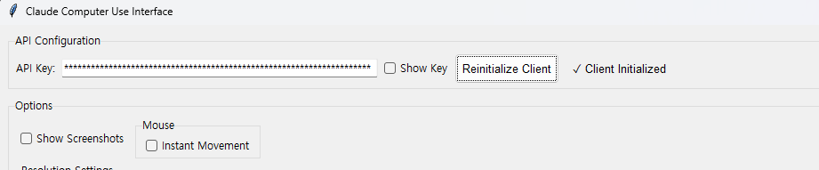

# ClaudeComputerUseBeta-Win64

## Beta trial code for the Claude 3.5 Sonnet Computer Use (Beta) on Win64.

#####  As noted in the Anthropic Computer Use (Beta) Documentation, it is recommended that the Computer Use to be ran in Virtual Machines. 

For Docker based Computer Use (Beta), please visit https://github.com/anthropics/anthropic-quickstarts/tree/main/computer-use-demo.


## Step 1. main.py - insert your Claude API Key, and press Initlialize.




## Step 2. Write your prompt and press Submit.


## Current Status

- Errors in correctly locating the cursor. This may be due to image downscaling (due to token length limit)
- Errors in identifying whether the goal has been achieved.
- Currently taking two screenshots at the beginning of the task. 
- Need calibration of the awaiting time for the actions to complete. 

## Known Errors
```
Error: Client initialization failed: Failed to validate API key: 'Beta' object has no attribute 'messages'
```
-> pip install --upgrade anthropic
