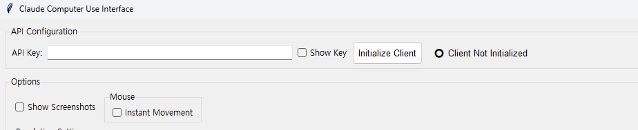
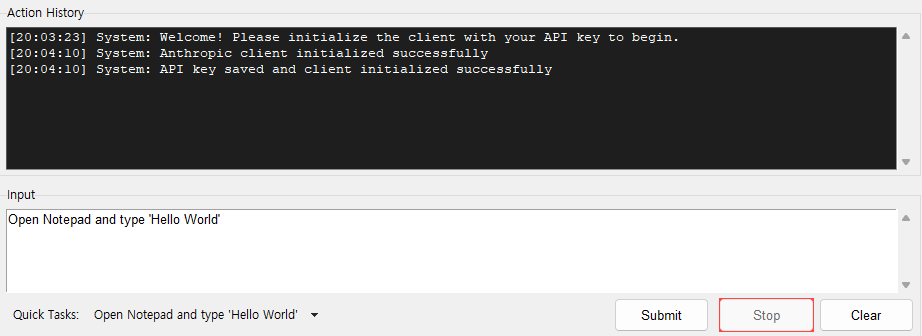

# ClaudeComputerUseBeta-Win64

Beta trial code for the **Claude 3.5 Sonnet Computer Use (Beta) on __Win64__**.

⚠️ **WARNING**: It is HIGHLY RECOMMENDED to run this application in a virtual machine environment for security and isolation purposes. Running this on your local machine directly carries potential security risks.

As noted in the [Anthropic Computer Use (Beta) Documentation](https://docs.anthropic.com/en/docs/build-with-claude/computer-use), it is recommended that the Computer Use be run in Virtual Machines. 

For Docker based Computer Use (Beta), please visit [Anthropic Computer Use (Beta)](https://github.com/anthropics/anthropic-quickstarts/tree/main/computer-use-demo).

Participation is welcomed. Currently facing many issues with calibration of the awaiting time for the actions to complete and the accuracy of the goal recognition. 

## Installation and Setup

### Recommended: Using a Virtual Machine

1. Set up a virtual machine using software like VMware or VirtualBox.

2. Clone the repository in your virtual machine:
   ```
   git clone https://github.com/MinjaeKIM753/ClaudeComputerUseBeta-Win64.git
   cd ClaudeComputerUseBeta-Win64
   ```

3. Install the required packages:
   ```
   pip install -r requirements.txt
   ```

4. Set up your Anthropic API key:
   - Create a `.env` file in the project root directory
   - Add your API key to the file:
     ```
     ANTHROPIC_API_KEY=your_api_key_here
     ```

5. Run the application:
   ```
   python main.py
   ```

Note: Make sure you have Python 3.7 or higher installed on your system.

## Usage

### Step 1. Initialize with API Key

Insert your Claude API Key in the main window, and press Initialize.




### Step 2. Submit Your Prompt

Write your prompt in the input box and press Submit.



### Optional

- Show Screenshots in Conversation : This will show halved resolution screenshots from the image sent to the Claude. Displays on the right.

- Teleport Mouse : For mouse movement, if checked, this will teleport the mouse. Otherwise it will gradually move.

- Downscale : Downscale factor for the screenshots. __(Practically, 0.5 is believed to perform best.)__

## Current Status

- Errors in correctly locating the cursor. This may be due to image downscaling (due to token length limit)
- Errors in identifying whether the goal has been achieved.
- Currently taking two screenshots at the beginning of the task. 
- Need calibration of the awaiting time for the actions to complete. 

## Upcoming Features

- Add actions (double clicking, scrolling, waiting, right clicking, dragging, special keys(changing typing language))
- Improve GUI
- Improve memory lag (Currently, it reflects the previous task and the first task. This is to prevent hallucinations and repetitions.)

## Known Errors

```
Error: Client initialization failed: Failed to validate API key: 'Beta' object has no attribute 'messages'
```
Solution: pip install --upgrade anthropic


```
Error: Client initialization failed: cannot access local variable 'e' where it is not associated with a value
```
Solution: Check API Budget (and VPN Connection if your location does not allow Anthropic API)
